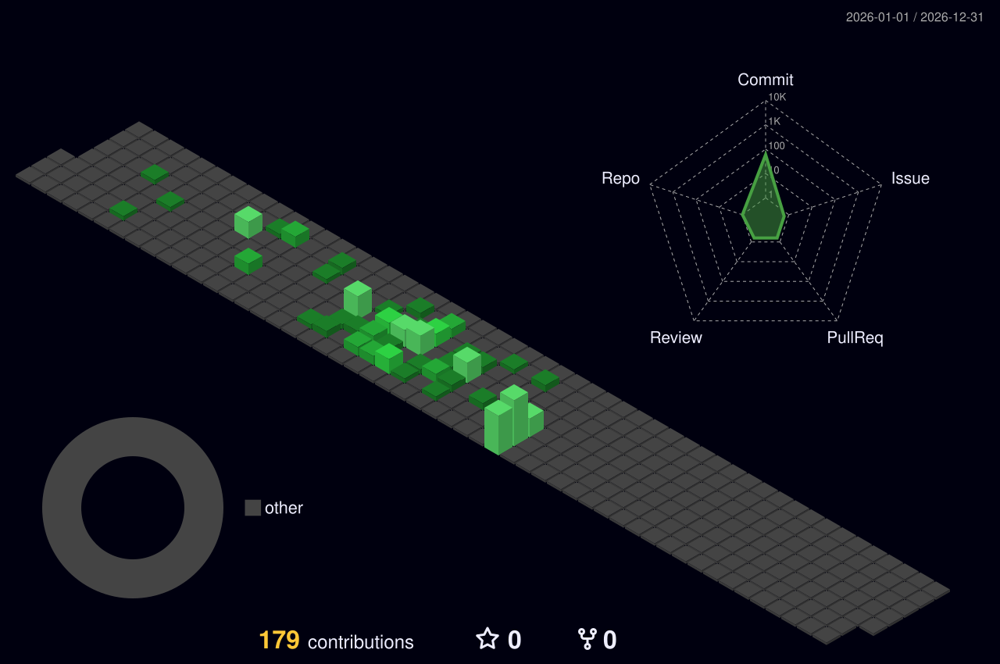
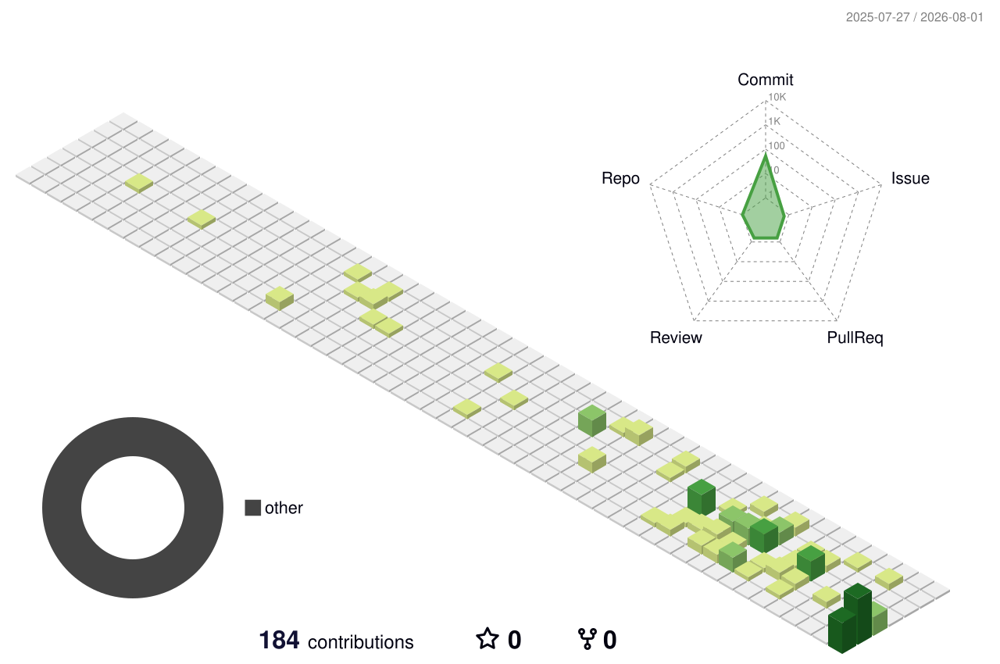

## Hi there 👋

<!--
**CNBbbratoev/CNBbbratoev** is a ✨ _special_ ✨ repository because its `README.md` (this file) appears on your GitHub profile.

Here are some ideas to get you started:

- 🔭 I’m currently working on ...
- 🌱 I’m currently learning ...
- 👯 I’m looking to collaborate on ...
- 🤔 I’m looking for help with ...
- 💬 Ask me about ...
- 📫 How to reach me: ...
- 😄 Pronouns: ...
- ⚡ Fun fact: ...
-->

### 📅 Contribution History

<!-- 1. The Active Year (Visible Immediately) -->

  <h4>2026 (Current Year)</h4>
  

 

<!-- 2. The Expandable Drawer Wrapper (Hidden Until Clicked) -->

<strong> Click to view (2025 - 2022)</strong>

  <h4>2025</h4>
  
    
  
  <h4>2024</h4>
  
    
  
  <h4>2023</h4>
  
    
  
  <h4>2022</h4>
  

